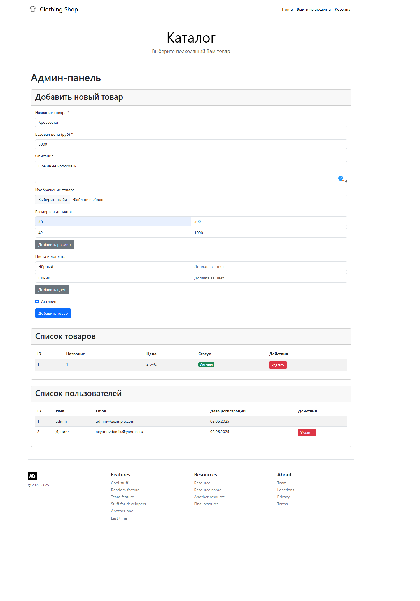

# Clothing Shop


## Описание
Этот проект представляет собой веб-приложение интернет-магазина одежды, разработанное с использованием
Flask.

Шаблоны для страниц хранятся в папке templates.  
База данных храниться в instance.  
Фотографии хранятся static/uploads.

## Возможности
1. Просмотр товаров.  
2. Корзина: Добавление/удаление товаров, изменение количества, оформление заказа.
3. Админ-панель: Управление товарами и пользователями

## Установка
1. Убедитесь, что у вас установлен Python версии 3.6 или выше.
2. Клонируйте репозиторий на ваш локальный компьютер.
3. Установите зависимости:
```bash
pip install -r requirements.txt
```

## Функционал
1. Запустите main.py и перейдите по адресу http://127.0.0.1:5000 в браузере. Откроется главная страница сайта.

2. При нажатии на кнопку "SigIn/LogIn" появиться страница авторизации/регистрации.

3. Введите данные для входа и нажмите "Войти". При удачном входе Вы увидите главную страницу сайта.
4. При нажатии на кнопку "В корзину" выбранный товар отобразиться в корзине.

4. Если вы вошли как admin, то у вас появляется доступ к админ-панели по адресу: http://127.0.0.1:5000/admin  
Логин: admin  
Почта: admin@example.com  
Пароль: 123456  

5. В админ-панели можно добавлять/удалять товары и пользователей.
